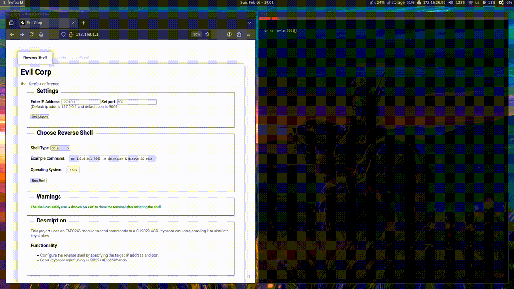
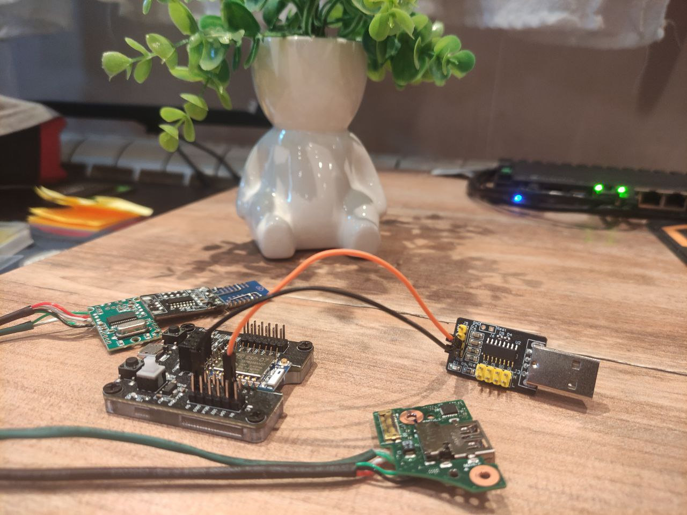
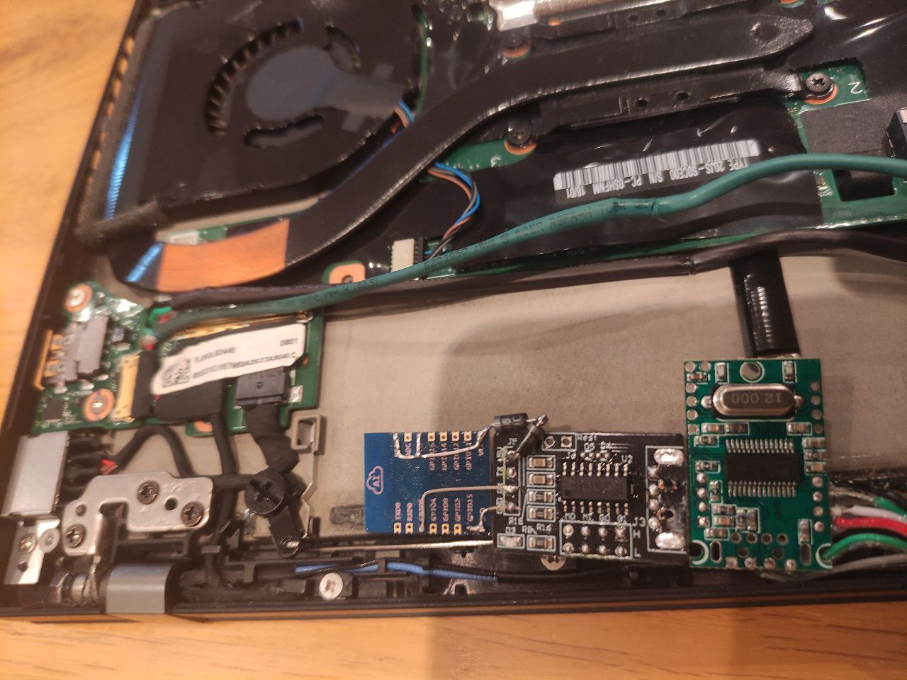
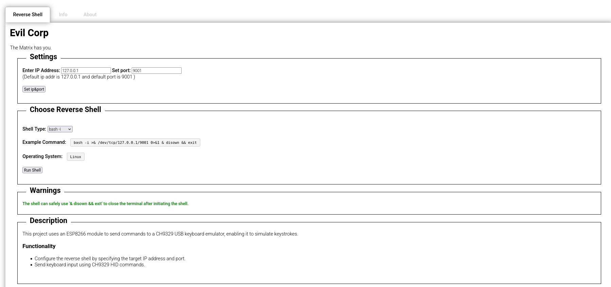

# ESP07CommandForge

## Description

This project enables a covert, wireless command execution system by using the **ESP-07** Wi-Fi module and the **CH9329** USB-to-HID chip. Unlike previous versions using an Arduino Pro Micro, the **CH9329** directly handles keyboard emulation, eliminating the need for voltage dividers or additional microcontrollers. The ESP-07 acts as a hidden Wi-Fi access point, allowing remote devices to send keystroke commands via the CH9329, effectively turning any laptop or keyboard into a stealthy command injection tool. This Proof of Concept (POC) is intended for educational purposes and experimentation.



---

## Dependencies

### Hardware
- **ESP-07 Wi-Fi module** – Acts as a wireless command receiver.
- **CH9329 USB-to-HID module** – Emulates a keyboard to execute received commands.
- **Laptop or host device** – Powers and conceals the setup.
- **Small USB hub (optional)** – Helps embed components while keeping USB functionality.
- **ESP8266Burn debugger** for programing ESP-07
    

### Software
- **Arduino IDE 2.x** – Required for flashing the ESP-07 firmware.
- **ESP8266 Board Package** – Required for compiling and uploading firmware to the ESP-07.
- **ArduinoJson Library** – Parses and structures commands sent to the ESP-07.
    

---

## Installation Guide

### 1. Setting Up Arduino IDE 2.x
To install the required dependencies for the ESP-07:

1. **Install the ESP8266 Board Package:**
    - Open **Arduino IDE 2.x**.
    - Go to **File > Preferences**.
    - Add the following URL to **Additional Board Manager URLs**:
        - `http://arduino.esp8266.com/stable/package_esp8266com_index.json`
            
    - Open **Tools > Board > Board Manager**, search for `ESP8266`, and install it.
        
2. **Install Required Libraries:**
    - Open **Tools > Library Manager**.
    - Search for and install **ArduinoJson**.
        

---

### 2. Flashing the ESP-07

1. Open the `sketch_esp07.ino` file in Arduino IDE.
2. Place the `data` folder (containing HTML and script files) in the same directory as the sketch.
3. Connect the ESP-07 to your computer using an ESP8266Burn debugger.
4. Select the correct **ESP8266 board** and **COM port** in Arduino IDE.
5. Upload the sketch to the ESP-07.
6. To upload files to the ESP-07 on Arduino IDE 2, use the **LittleFS Uploader plugin**:
    - **Installing the LittleFS Uploader Plugin**
	    1. Go to the [releases page](https://github.com/earlephilhower/arduino-littlefs-upload/releases/download/1.5.3/arduino-littlefs-upload-1.5.3.vsix) and click the .vsix file to download.
	    2. On your computer, navigate to the following path:
	        - **Windows**: `C:\Users\<username>\.arduinoIDE\`
	        - **Linux**: `~/.arduinoIDE/` Create a new folder called `plugins` if you haven’t already.
	    3. Move the `.vsix` file you downloaded previously to the `plugins` folder (remove any other previous versions of the same plugin if that’s the case).
	    4. Restart or open the Arduino IDE 2. To check if the plugin was successfully installed, press **[Ctrl] + [Shift] + [P]** to open the command palette. An instruction called **‘Upload Little FS to Pico/ESP8266/ESP32‘** should be there (just scroll down or search for the name of the instruction).
        
7. Use **Upload Little FS to Pico/ESP8266/ESP32** to upload the `data` folder contents to SPIFFS.





---

### 3. Connecting the ESP-07 to CH9329

Unlike Arduino-based solutions, the CH9329 does not require voltage dividers, making wiring simpler:

```

					 CH 9329                                ESP-07  
       ______________                           ___________
      |              |                         |           |  
      |              |                 +-----> | GPIO 15   |  
      |         GND  | <---------------+-----> | GND       |  
      |              |                         |           |  
      |              |                         |           |  
      |              |                 +-----> | EN        |  
      |              |                 +-----> | RST       |  
      |       VCC-5V | <---|>|--|>|----+-----> | VCC       |  
      |              |  2 x (1N4007)           |           |  
      |              |                         |           |  
      |              |                         |           |  
      |     UART RX  | <---------------------> | TX (5)    |  
      |              |                         |           |  
      |______________|                         |___________|


  
Legend:  
- Power Connection:  
  - Use two diodes in series (1N4007) to drop VCC from 5V to 3.3V for ESP-07.  
  
- Communication:  
  - ESP-07 TX (3.3V)   → Direct Connection → CH9329 RX  
  
  
- EN (Enable):  
  - Connect the EN pin of the ESP-07 to 3.3V.   
  - This pin must be high for the ESP-07 to function.  
  
- RST (Reset):  
  - Connect the RST pin of the ESP-07 to 3.3V.  
  - This ensures the module is not held in reset mode.  
  
- GND: Ensure GND pins of both devices are connected.  
  
- GPIO 15:  
  - Connect the GPIO 15 pin of the ESP-07 to GND.  
  - This is a boot configuration pin that must be grounded,  
    for the ESP-07 to boot into the correct mode.
```

- **Data Transmission:** The ESP-07 sends keystroke commands over UART to the CH9329, which converts them into USB HID keyboard inputs.
    

---

### 4. Hiding the Device

#### **Inside a Laptop**
- Install the ESP-07 and CH9329 inside the laptop casing, utilizing space near an unused SSD bay or the compartment for a secondary battery, as found in some laptops like the **Lenovo ThinkPad T460s**, which was the approach used in our case.
- Secure the wiring to avoid interference with moving parts.




#### **Inside a Keyboard**
- Place the ESP-07 and CH9329 inside a mechanical keyboard, connecting it to the internal USB wiring.
- Ensure sufficient insulation to prevent short circuits.
    

---

### 5. Using the Setup

1. **Power on the system** – The ESP-07 will start broadcasting a Wi-Fi access point.
2. **Connect to the Wi-Fi network:**
    - **SSID:** `- ESP8266-Access-Point`
    - **Password:** `123456789`
3. **Access the Web Interface:**
    - Open a web browser and navigate to `http://192.168.1.1`.
4. **Configure and Run Reverse Shell:**
    - In the web interface, select the desired reverse shell type (e.g., Bash, PowerShell, Python, or Netcat).
    - Set the **IP address** and **port** of the remote listener.
    - Click **Run Shell** – The CH9329 will open a terminal, type the command, and execute it silently using `disown && exit`, ensuring the terminal closes immediately so the laptop user does not notice the reverse shell initiation.




---

## Disclaimer
- This project is for educational and research purposes only.
- The author is not responsible for any misuse, legal issues, or unintended consequences.
- **Use responsibly!** ⚠️